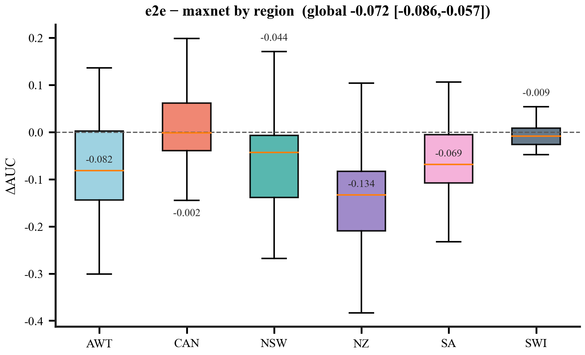
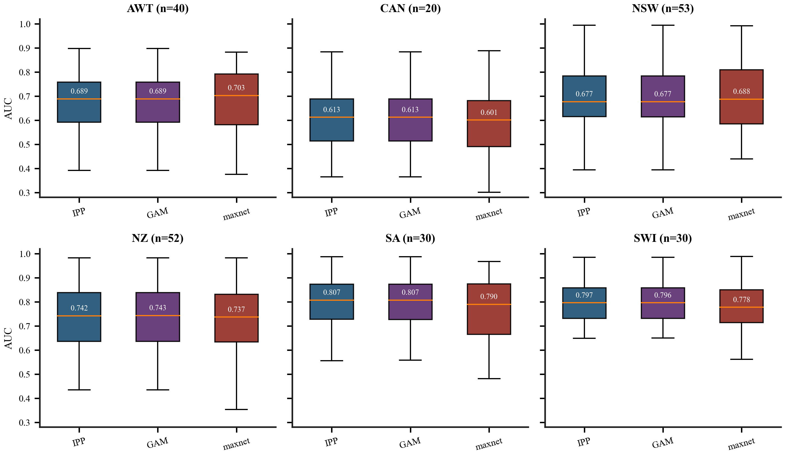
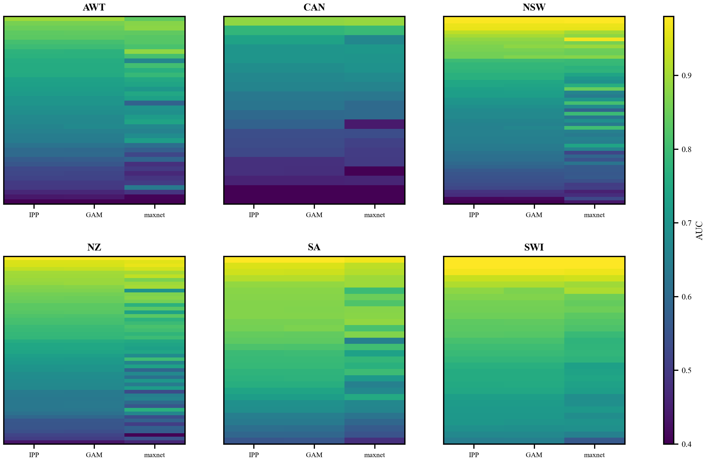
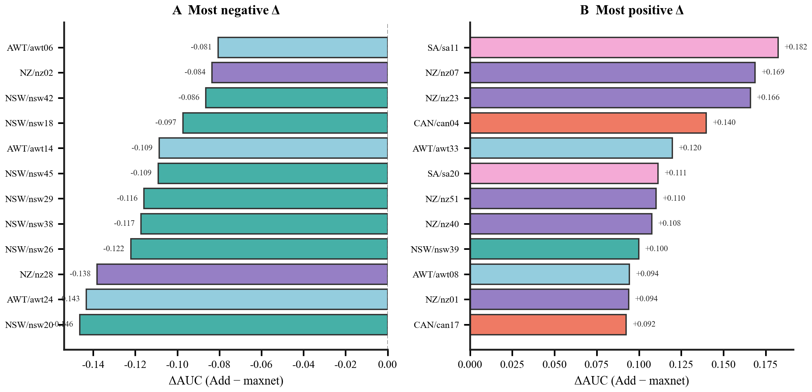
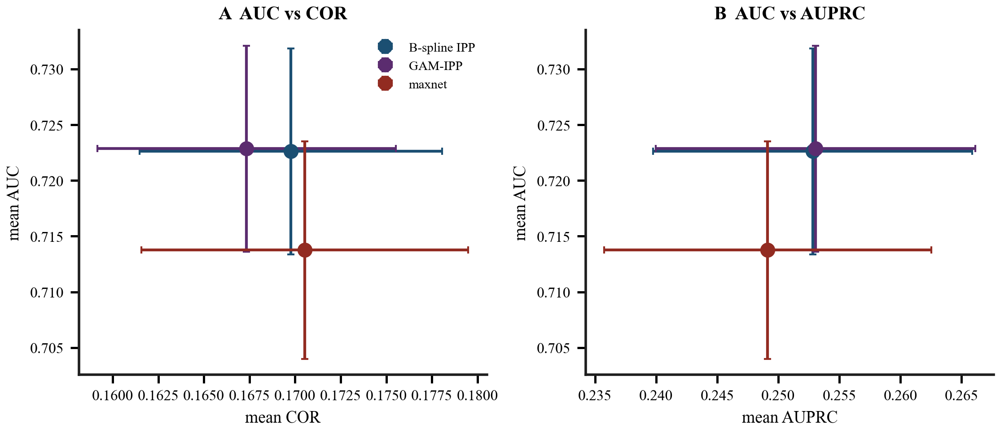

# Supporting Information

<!-- SI version v7.2 | matches MS_Methods_Results_zh_v7.2.md | frozen 2026-08-15 -->
**SI version v7.2.** Matches `MS_Methods_Results_zh_v7.2.md`. Live figures: `SI/figures/`. Freeze: `SI/versions/v7.2/`. Plot: `benchmarks/plot_ms_closure_v7.2.py`. Legacy four-model SI (v7, BCE columns): `SI/versions/v7/` + `generate_si_v7.py`.

**Article.** Does deep interaction inside Kolmogorov–Arnold Networks improve presence-only species distribution models?

本补充材料提供主文未展开的分区汇总、配对对比、目标群背景敏感性与物种明细。除特别说明外，数值均对应主文主分析：物种级光滑惩罚 $\lambda_s^\star$，独立 presence–absence 评价（$n_{\mathrm{PO}}\ge 5$ 的 225 个物种）。图中不嵌入图题。过长的物种全表另附可机读文件，其余表格直接列于下文。

---

## Supplementary figures

### Figure S1

**Figure S1.** 端到端标准 KAN（intention-to-treat 补救后）相对 maxnet 的物种水平 $\Delta$AUC，按 NCEAS 区域分箱。箱线为四分位距与中位数，须线为 Tukey 篱笆；箱体按区域着色，与主文 Fig. 1 一致。虚线表示零差异。数字为各箱中位数（三位小数）：箱体足够高且中位数远离零线时标在箱内，否则标在箱外。图题给出全局均值与自助 95% 置信区间；主文配对散点见图 1。

### Figure S2

**Figure S2.** 各 NCEAS 区域内物种水平独立 presence–absence 评价的 AUC。自左至右依次为 B-spline IPP、同基 GAM-IPP 与 maxnet（背景上限 10,000）；箱体使用与主文 Fig. 2 一致的方法色（海军蓝 / 深紫 / 砖红）。箱线为四分位距与中位数，须线为 Tukey 篱笆。深色箱内的白色数字为中位数（三位小数，无描边）。$n$ 为该区有效物种数。

### Figure S3

**Figure S3.** 分区物种×模型 AUC 热图。每一行是一个物种，按区内 B-spline IPP 的 AUC 降序排列；列为 B-spline IPP、同基 GAM-IPP 与 maxnet。色标置于图右侧，表示 AUC。

### Figure S4

**Figure S4.** 物种水平 $\Delta$AUC（B-spline IPP 减去 maxnet）两端各 12 个物种。(A) 最负的 12 个差值；(B) 最正的 12 个差值。条形按区域着色，与主文区域色一致；柱端标注 $\Delta$ 数值。虚线表示零差异。

### Figure S5

**Figure S5.** 加性模型在独立 presence–absence 评价上的多指标平面（物种水平均值 ± 标准误）。(A) 平均 AUC 对平均 COR。(B) 平均 AUC 对平均 AUPRC。点色与主文方法色一致，依次为 B-spline IPP、同基 GAM-IPP 与 maxnet。本图仅包含上述三种加性模型；端到端标准 KAN 的 COR 约为 0.12，不在此平面上展示。

---

## Supplementary tables

### Table S1. 全局汇总指标（物种水平）

| 模型 | 物种数 | 平均 AUC | AUC 标准差 | 平均 AUPRC | 平均 PRG | 平均 COR |
| --- | --- | --- | --- | --- | --- | --- |
| B-spline IPP | 225 | 0.7226 | 0.1384 | 0.2528 | 0.4555 | 0.1698 |
| 同基 GAM-IPP | 225 | 0.7229 | 0.1385 | 0.2530 | 0.4561 | 0.1673 |
| maxnet（背景上限 10,000） | 225 | 0.7138 | 0.1465 | 0.2491 | 0.4319 | 0.1705 |
| maxnet（背景上限 50,000） | 222 | 0.7145 | 0.1467 | 0.2456 | 0.4344 | 0.1703 |
| Deep-2（边输出） | 225 | 0.7178 | 0.1351 | — | — | — |
| Deep-2（缩放协变量） | 225 | 0.7141 | 0.1434 | — | — | — |
| Deep-3（边输出） | 225 | 0.7015 | 0.1306 | — | — | — |
| Deep-3（缩放协变量） | 225 | 0.6836 | 0.1253 | — | — | — |
| 端到端标准 KAN | 225 | 0.6420 | 0.1240 | 0.2102 | 0.3115 | 0.1209 |

### Table S2. 各区域加性模型与 maxnet 的平均 AUC

| 区域 | 物种数 | 加性平均 AUC | 加性 SD | GAM 平均 AUC | maxnet 平均 AUC | 加性 − maxnet |
| --- | --- | --- | --- | --- | --- | --- |
| AWT | 40 | 0.6724 | 0.1253 | 0.6727 | 0.6775 | -0.0051 |
| CAN | 20 | 0.6015 | 0.1323 | 0.6015 | 0.5813 | 0.0202 |
| NSW | 53 | 0.7038 | 0.1451 | 0.7046 | 0.7069 | -0.0031 |
| NZ | 52 | 0.7381 | 0.1302 | 0.7384 | 0.7288 | 0.0094 |
| SA | 30 | 0.7944 | 0.1111 | 0.7945 | 0.7620 | 0.0324 |
| SWI | 30 | 0.8048 | 0.0924 | 0.8042 | 0.7882 | 0.0166 |

### Table S3. 各区域平均 AUPRC（按模型）

| 区域 | B-spline IPP | 同基 GAM-IPP | maxnet |
| --- | --- | --- | --- |
| AWT | 0.4332 | 0.4338 | 0.4497 |
| CAN | 0.1147 | 0.1146 | 0.1130 |
| NSW | 0.2412 | 0.2416 | 0.2423 |
| NZ | 0.1741 | 0.1741 | 0.1807 |
| SA | 0.2965 | 0.2963 | 0.2486 |
| SWI | 0.2178 | 0.2182 | 0.2037 |

### Table S4. 各区域平均 PRG（按模型）

| 区域 | B-spline IPP | 同基 GAM-IPP | maxnet |
| --- | --- | --- | --- |
| AWT | 0.3488 | 0.3500 | 0.3532 |
| CAN | 0.2012 | 0.2010 | 0.1470 |
| NSW | 0.4066 | 0.4077 | 0.4099 |
| NZ | 0.5060 | 0.5065 | 0.4792 |
| SA | 0.5657 | 0.5669 | 0.4954 |
| SWI | 0.6557 | 0.6551 | 0.6204 |

### Table S5. 主分析关键配对 $\Delta$AUC（bootstrap 95% 置信区间）

| 对比 | 平均 $\Delta$AUC | 95% CI 下限 | 95% CI 上限 | 物种数 |
|:-----|-----------------:|------------:|------------:|-------:|
| B-spline IPP − 同基 GAM-IPP | -0.0002 | -0.0006 | 0.0000 | 225 |
| B-spline IPP − maxnet（背景上限 10,000） | +0.0089 | +0.0023 | +0.0152 | 225 |
| Deep-2（边输出） − 加性 | -0.0048 | -0.0099 | -0.0001 | 225 |
| Deep-2（缩放协变量） − 加性 | -0.0085 | -0.0137 | -0.0035 | 225 |
| Deep-3（边输出） − 加性 | -0.0211 | -0.0270 | -0.0155 | 225 |
| Deep-3（缩放协变量） − 加性 | -0.0390 | -0.0463 | -0.0321 | 225 |
| 端到端标准 KAN − maxnet | -0.0717 | -0.0859 | -0.0571 | 225 |

### Table S6. 按训练出现记录数分层的 B-spline IPP 平均 AUC

| 训练出现记录数区间 | 物种数 | 平均 AUC | 标准差 |
| --- | --- | --- | --- |
| ≤10 | 10 | 0.6017 | 0.1426 |
| 11–30 | 51 | 0.7134 | 0.1458 |
| 31–100 | 79 | 0.7575 | 0.1424 |
| 101–500 | 66 | 0.6876 | 0.1230 |
| >500 | 19 | 0.7876 | 0.0636 |

### Table S7. CAN 区域 20 个物种的三模型 AUC（$\lambda_s^\star$）

| 物种 | B-spline IPP | 同基 GAM-IPP | maxnet |
| --- | --- | --- | --- |
| can01 | 0.7348 | 0.7348 | 0.6696 |
| can02 | 0.7028 | 0.7028 | 0.7074 |
| can03 | 0.4574 | 0.4574 | 0.4603 |
| can04 | 0.5826 | 0.5833 | 0.4428 |
| can05 | 0.6315 | 0.6314 | 0.6301 |
| can06 | 0.8842 | 0.8842 | 0.8884 |
| can07 | 0.6622 | 0.6622 | 0.6588 |
| can08 | 0.5398 | 0.5396 | 0.5381 |
| can09 | 0.7019 | 0.7019 | 0.6999 |
| can10 | 0.6686 | 0.6686 | 0.6772 |
| can11 | 0.5986 | 0.5986 | 0.6012 |
| can12 | 0.5342 | 0.5343 | 0.5115 |
| can13 | 0.3655 | 0.3655 | 0.3583 |
| can14 | 0.3892 | 0.3893 | 0.3017 |
| can15 | 0.6843 | 0.6843 | 0.6959 |
| can16 | 0.5254 | 0.5253 | 0.5023 |
| can17 | 0.4796 | 0.4790 | 0.3872 |
| can18 | 0.7809 | 0.7810 | 0.7925 |
| can19 | 0.4803 | 0.4802 | 0.5015 |
| can20 | 0.6264 | 0.6265 | 0.6008 |

### Table S8. 目标群背景敏感性：模型级配对 $\Delta$AUC（TGB 减去随机 50,000 背景）

在 NSW 的 12 个物种上，采用与主分析相同的 $\lambda_s^\star$，对随机背景与目标群背景分别重新拟合。maxnet 在目标群背景下仅部分物种收敛，故 $n$ 小于 12。

| 模型 | 物种数 | 随机背景平均 AUC | 目标群背景平均 AUC | 平均 Δ（目标群 − 随机） | 95% CI 下限 | 95% CI 上限 |
| --- | --- | --- | --- | --- | --- | --- |
| BCE | 12 | 0.6565 | 0.6469 | -0.0096 | -0.0506 | 0.0296 |
| B-spline IPP | 12 | 0.6532 | 0.6522 | -0.0010 | -0.0432 | 0.0432 |
| 同基 GAM-IPP | 12 | 0.6532 | 0.6517 | -0.0014 | -0.0436 | 0.0429 |
| maxnet（背景上限 10,000） | 5 | 0.6311 | 0.6920 | 0.0609 | 0.0105 | 0.1135 |
| maxnet（背景上限 50,000） | 5 | 0.6363 | 0.6920 | 0.0557 | 0.0071 | 0.1066 |

### Table S9. 目标群背景敏感性：物种级配对结果（B-spline IPP、同基 GAM-IPP 与 BCE）

完整五模型物种级长表见可机读文件 `tables/TableS9_TGB_species_paired.csv`。

| 物种 | 训练出现数 | $\lambda_s^\star$ | 模型 | 随机背景 AUC | 目标群背景 AUC | $\Delta$ | 目标群背景点数 | 目标群是否收敛 |
| --- | --- | --- | --- | --- | --- | --- | --- | --- |
| nsw04 | 49 | 0.0001 | BCE | 0.8318 | 0.8286 | -0.0033 | 138 | 是 |
| nsw04 | 49 | 0.0001 | B-spline IPP | 0.8629 | 0.8150 | -0.0479 | 138 | 是 |
| nsw04 | 49 | 0.0001 | 同基 GAM-IPP | 0.8629 | 0.8121 | -0.0508 | 138 | 是 |
| nsw06 | 44 | 1.0000 | BCE | 0.5081 | 0.5134 | 0.0053 | 143 | 是 |
| nsw06 | 44 | 1.0000 | B-spline IPP | 0.4751 | 0.5189 | 0.0438 | 143 | 是 |
| nsw06 | 44 | 1.0000 | 同基 GAM-IPP | 0.4752 | 0.5185 | 0.0433 | 143 | 是 |
| nsw09 | 426 | 1.0000 | BCE | 0.5624 | 0.6722 | 0.1099 | 1087 | 是 |
| nsw09 | 426 | 1.0000 | B-spline IPP | 0.5879 | 0.6817 | 0.0938 | 1087 | 是 |
| nsw09 | 426 | 1.0000 | 同基 GAM-IPP | 0.5879 | 0.6817 | 0.0938 | 1087 | 是 |
| nsw14 | 315 | 0.0100 | BCE | 0.6566 | 0.7530 | 0.0964 | 1198 | 是 |
| nsw14 | 315 | 0.0100 | B-spline IPP | 0.6494 | 0.7672 | 0.1178 | 1198 | 是 |
| nsw14 | 315 | 0.0100 | 同基 GAM-IPP | 0.6492 | 0.7664 | 0.1172 | 1198 | 是 |
| nsw16 | 120 | 1.0000 | BCE | 0.6333 | 0.6193 | -0.0140 | 148 | 是 |
| nsw16 | 120 | 1.0000 | B-spline IPP | 0.6546 | 0.6265 | -0.0281 | 148 | 是 |
| nsw16 | 120 | 1.0000 | 同基 GAM-IPP | 0.6546 | 0.6265 | -0.0281 | 148 | 是 |
| nsw17 | 148 | 0.1000 | BCE | 0.5713 | 0.5042 | -0.0671 | 120 | 是 |
| nsw17 | 148 | 0.1000 | B-spline IPP | 0.5229 | 0.5272 | 0.0043 | 120 | 是 |
| nsw17 | 148 | 0.1000 | 同基 GAM-IPP | 0.5229 | 0.5272 | 0.0043 | 120 | 是 |
| nsw18 | 69 | 0.1000 | BCE | 0.7024 | 0.7365 | 0.0341 | 270 | 是 |
| nsw18 | 69 | 0.1000 | B-spline IPP | 0.6407 | 0.7411 | 0.1004 | 270 | 是 |
| nsw18 | 69 | 0.1000 | 同基 GAM-IPP | 0.6406 | 0.7410 | 0.1005 | 270 | 是 |
| nsw24 | 68 | 1.0000 | BCE | 0.6866 | 0.7163 | 0.0297 | 271 | 是 |
| nsw24 | 68 | 1.0000 | B-spline IPP | 0.6774 | 0.7039 | 0.0265 | 271 | 是 |
| nsw24 | 68 | 1.0000 | 同基 GAM-IPP | 0.6774 | 0.7038 | 0.0265 | 271 | 是 |
| nsw28 | 53 | 1.0000 | BCE | 0.6463 | 0.5931 | -0.0532 | 114 | 是 |
| nsw28 | 53 | 1.0000 | B-spline IPP | 0.6879 | 0.5840 | -0.1039 | 114 | 是 |
| nsw28 | 53 | 1.0000 | 同基 GAM-IPP | 0.6880 | 0.5840 | -0.1039 | 114 | 是 |
| nsw39 | 16 | 0.0100 | BCE | 0.6229 | 0.4635 | -0.1594 | 48 | 是 |
| nsw39 | 16 | 0.0100 | B-spline IPP | 0.6214 | 0.4740 | -0.1474 | 48 | 是 |
| nsw39 | 16 | 0.0100 | 同基 GAM-IPP | 0.6212 | 0.4730 | -0.1482 | 48 | 是 |
| nsw43 | 42 | 0.1000 | BCE | 0.6467 | 0.5775 | -0.0692 | 68 | 是 |
| nsw43 | 42 | 0.1000 | B-spline IPP | 0.6609 | 0.5943 | -0.0666 | 68 | 是 |
| nsw43 | 42 | 0.1000 | 同基 GAM-IPP | 0.6610 | 0.5943 | -0.0667 | 68 | 是 |
| nsw52 | 186 | 1.0000 | BCE | 0.8090 | 0.7849 | -0.0242 | 489 | 是 |
| nsw52 | 186 | 1.0000 | B-spline IPP | 0.7973 | 0.7923 | -0.0050 | 489 | 是 |
| nsw52 | 186 | 1.0000 | 同基 GAM-IPP | 0.7973 | 0.7923 | -0.0050 | 489 | 是 |

### Table S10. 公平残差深度模型相对加性基线的分区平均 $\Delta$AUC

| 模型 | 区域 | 物种数 | 平均 $\Delta$AUC | 95% CI 下限 | 95% CI 上限 |
| --- | --- | --- | --- | --- | --- |
| Deep-2（边输出） | AWT | 40 | 0.0001 | -0.0103 | 0.0111 |
| Deep-2（边输出） | CAN | 20 | 0.0053 | -0.0053 | 0.0196 |
| Deep-2（边输出） | NSW | 53 | -0.0097 | -0.0221 | 0.0018 |
| Deep-2（边输出） | NZ | 52 | -0.0099 | -0.0205 | -0.0004 |
| Deep-2（边输出） | SA | 30 | -0.0051 | -0.0198 | 0.0091 |
| Deep-2（边输出） | SWI | 30 | -0.0003 | -0.0039 | 0.0029 |
| Deep-2（缩放协变量） | AWT | 40 | -0.0065 | -0.0171 | 0.0039 |
| Deep-2（缩放协变量） | CAN | 20 | -0.0041 | -0.0105 | 0.0019 |
| Deep-2（缩放协变量） | NSW | 53 | -0.0085 | -0.0238 | 0.0073 |
| Deep-2（缩放协变量） | NZ | 52 | -0.0131 | -0.0246 | -0.0027 |
| Deep-2（缩放协变量） | SA | 30 | -0.0124 | -0.0241 | -0.0011 |
| Deep-2（缩放协变量） | SWI | 30 | -0.0021 | -0.0053 | 0.0009 |
| Deep-3（边输出） | AWT | 40 | -0.0262 | -0.0428 | -0.0111 |
| Deep-3（边输出） | CAN | 20 | 0.0034 | -0.0126 | 0.0206 |
| Deep-3（边输出） | NSW | 53 | -0.0230 | -0.0349 | -0.0119 |
| Deep-3（边输出） | NZ | 52 | -0.0350 | -0.0473 | -0.0245 |
| Deep-3（边输出） | SA | 30 | -0.0193 | -0.0362 | -0.0035 |
| Deep-3（边输出） | SWI | 30 | -0.0050 | -0.0092 | -0.0010 |
| Deep-3（缩放协变量） | AWT | 40 | -0.0325 | -0.0486 | -0.0174 |
| Deep-3（缩放协变量） | CAN | 20 | -0.0033 | -0.0185 | 0.0119 |
| Deep-3（缩放协变量） | NSW | 53 | -0.0357 | -0.0502 | -0.0214 |
| Deep-3（缩放协变量） | NZ | 52 | -0.0685 | -0.0829 | -0.0549 |
| Deep-3（缩放协变量） | SA | 30 | -0.0543 | -0.0758 | -0.0324 |
| Deep-3（缩放协变量） | SWI | 30 | -0.0109 | -0.0172 | -0.0048 |

### Table S11. 响应曲线一致性：分区平均 Pearson $r$

| 区域 | 曲线对数 | 平均 $r$ | 中位数 $r$ | 最小 $r$ |
| --- | --- | --- | --- | --- |
| AWT | 24 | 0.9991 | 0.9999 | 0.9907 |
| CAN | 18 | 0.9894 | 0.9995 | 0.9140 |
| NSW | 33 | 0.9958 | 0.9999 | 0.9388 |
| NZ | 27 | 0.9959 | 0.9996 | 0.9438 |
| SA | 24 | 0.9991 | 0.9998 | 0.9930 |
| SWI | 33 | 0.9567 | 0.9958 | 0.4680 |

### 过长而不在此展开的数据文件

下列材料因行数较多，以独立文件提供，便于复核与再分析：

| 文件 | 内容 |
|:-----|:-----|
| `tables/TableS12_species_model_AUC.csv` | 225 个物种 × 各模型的 AUC 宽表（含 Deep-2/3 与端到端 ITT） |
| `tables/TableS12_species_model_COR.csv` | 对应 COR 宽表（加性、maxnet 与端到端标准 KAN） |
| `tables/TableS9_TGB_species_paired.csv` | 目标群背景敏感性的五模型物种级配对 |
| `tables/TableS11_curve_pairs.csv` | 159 条特征×物种响应曲线对的 Pearson $r$ |
| `tables/TableS13_lambda_star.csv` | 物种级 $\lambda_s^\star$ 与选择路径 |
| `tables/TableS14_e2e_species_itt.csv` | 端到端标准 KAN 的 ITT 物种明细与补救状态 |

---

## 补充说明

主文 Fig. 4 的响应曲线比较用于核对同基实现；物种级主证据仍是 $\lambda_s^\star$ 下 AUC 的高度一致。目标群背景分析与主分析使用同一套 $\lambda_s^\star$，并在随机背景与目标群背景上分别重新拟合。
